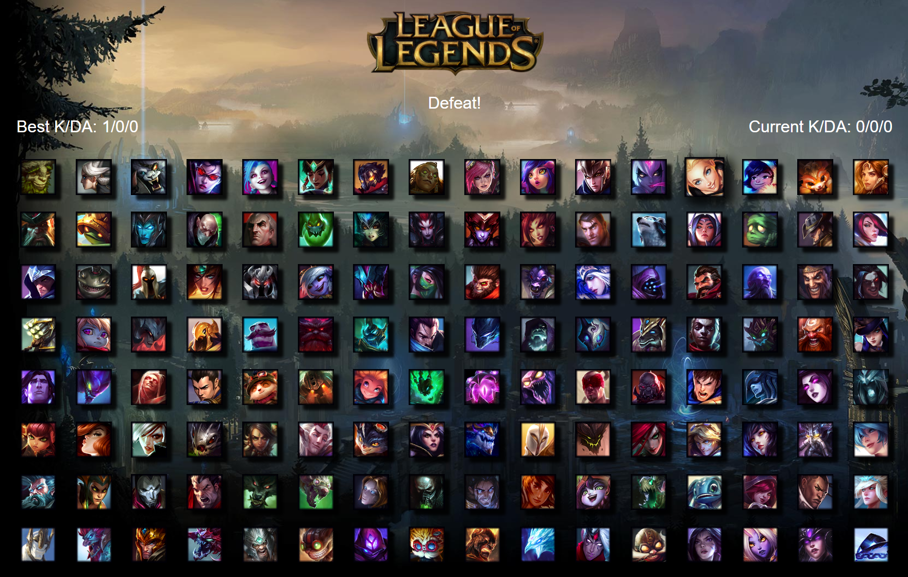

# [League of Legends Memory Game](https://league-of-legends-memory-.herokuapp.com/) 

This is my first ever application built with React! It's a memory game where you win by remembering which champions you have clicked on already. Each time you click a champion the order of champions is shuffled around. Try to get the highest obtainable Kill Death Ratio (144/0/0). You will be challenger rank in no time!

## Built with
* React
* HTML5
* CSS3
* JavaScript
* Node.js
* Media queries

## Deployed to Heroku!
Click on the link to play! 

https://league-of-legends-memory-game.herokuapp.com/

## Here is a preview of the app:

